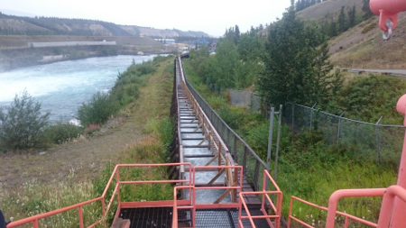
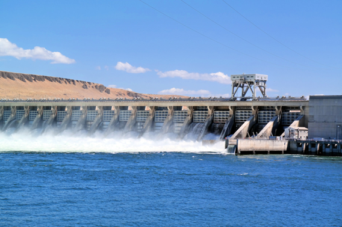
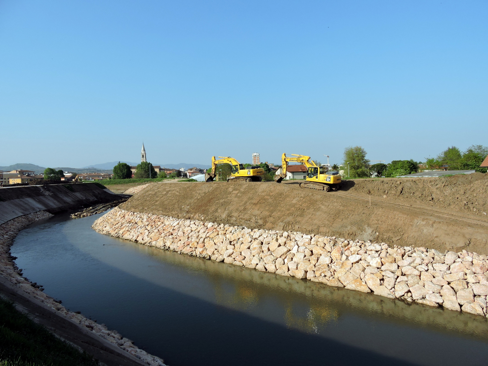
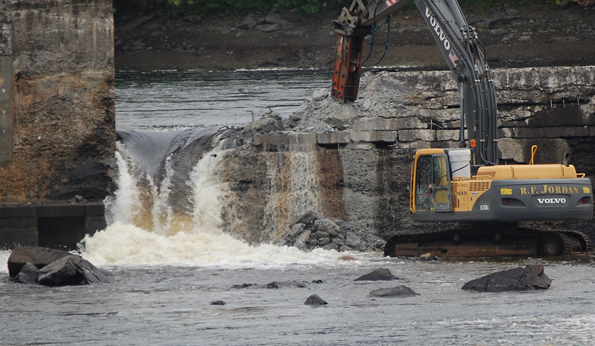
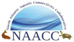
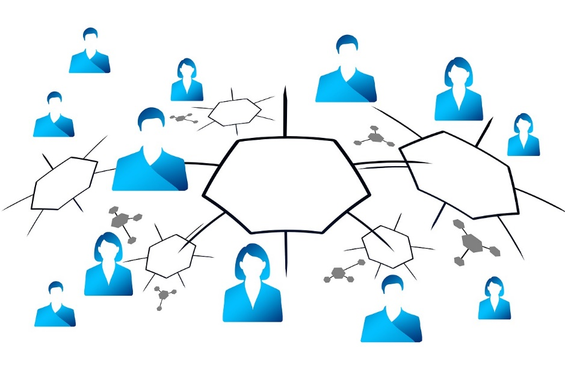
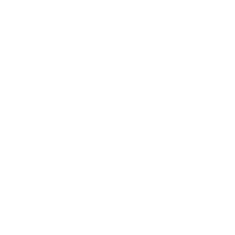

---
title:
author:
date:
output:
  revealjs::revealjs_presentation:
    css: style.css
    incremental: false
    theme: night
    highlight: tango
    transition: none
    center: true
---

# {data-background-color="#0a4f58"}

<h2 style="color: #de3c26;">
Canadian Aquatic Barriers Database
</h2>

<h3>
A tool to support freshwater connectivity restoration and policy
</h3>

<h5>
Nick Mazany-Wright
</h5>

<h5>
April 26, 2023
</h5>

&nbsp;
&nbsp;

<center>
Session 3: A Survey of Select Canadian Tributaries and Threats to Fish and Fish Habitat
</center>

<center>
Baseline Coastal Habitat Survey for the Canadian Great Lakes
</center>

&nbsp;
&nbsp;

<div class="container">
<div class="col">
``` {r, echo=FALSE, out.width="50%", fig.align="left"}

knitr::include_graphics("./img/white-cwf-logo-en.svg")

#AWC3

```
</div>

<div class="col" style="justify-self: end; align-content: end;">
<span style="font-family: Bebas Neue;"></span>
</div>

</div>

# Canadian Wildlife Federation

## Who We Are

- One of Canada's largest environmental NGOs
- Originated in 1962 from fish and wildlife conservation movement
- "To conserve and inspire the conservation of Canada's wildlife and habitats for the use and enjoyment for all"
- Freshwater, marine, and terrestrial programs

&nbsp;

<center>
{height=200px} {height=200px} {height=200px}
</center>

## National Fish Passage Program

Increased freshwater focus on connectivity and fish passage:

- Chinook salmon research in Upper Yukon River
- American eel research and advocacy
- Fish passage advocacy and barrier campaigns
- Watershed Connectivity Restoration Planning framework in BC, AB, PEI, and NS
- Spatial tools to assess watershed connectivity and prioritize barriers for removal
- **<span style="color: #de3c26;">Development of the Canadian Aquatic Barriers Database (CABD)</span>**

<center>
{height=160px} {height=160px} {height=160px} {height=160px}
</center>

# Canadian Aquatic Barriers Database (CABD)

## What is the conservation issue?

What we know:

- Structures like dams, culverts, and dykes block the movement of fish (and other species) and energy/matter
- Barriers to connectivity are extensive across Canada
- Barrier removal needed to restore access to important habitat and ecosystem functions
- Restoration projects are expensive

<center>
{height=200px} {height=200px} {height=200px}
</center>

## What is the conservation issue?

What we don't know:

- How many barriers exist in Canada?
- How much habitat is not accessible?
- How do we identify the most important barriers to maximize benefits?

**<span style="color: #de3c26;">We need comprehensive information to answer these questions</span>**

## Canadian Aquatic Barriers Database (CABD)

<center>
**<span style="color: #de3c26;">Vision:</span>**
</center>

<center>
All Canada's barrier and connectivity information in one place -- easily and openly accessible!
</center>

## Project Background

- CABD = central pillar of tools to support CWF's fish passage program
- Identify and prioritize barriers for restoration
- Inspired TNC, NCC, and local/regional initiatives (e.g., Adopt a Stream, Fishwerks)

<center>

</center>

## A Roadmap for Improving Connectivity

- TNC's Northeast Aquatic Connectivity Assessment Project:
  + A database as a partnership building tool
  + Brings groups together and centralizes efforts
  + Led to significant improvements to fish passage and connectivity

## Importance of Collaboration and Engagement

- Potential uses of CABD extend beyond CWF's needs
- Launched external engagement to get input on development
- User interviews
  + What type of work could the CABD support?
  + What information would be useful?
  + How would users like to access the data?
- Working Group and Technical Advisory Committee

&nbsp;

<center>
{height=50px} {height=50px} {height=50px} {height=50px} {height=50px}
</center>

<center>
{height=25px} {height=50px} {height=25px}
{height=50px} {height=50px}
</center>

<center>
{height=50px} {height=50px} {height=50px}
{height=50px}
{height=50px}
</center>

## Data Gathering and Sharing

- CABD relies on existing repositories
  + Local in scale
  + Single barrier types
  + No standardization
- CWF provides national coordination **<span style="color: #de3c26;">without</span>** duplicating effort
- Establish **<span style="color: #de3c26;">reciprocal</span>** relationships
  + Share data back to providers

&nbsp;

<center>
{height=200px} {height=200px}
</center>

## What will the CABD be used for?

1. Habitat status assessments and reporting (watershed &rarr; national scales)
2. Informing management and regulatory decisions
3. Restoration planning and prioritization
4. Research and monitoring
5. Education and public outreach

## Barrier Data

<div class="container">
<div class="col">
- Standardized data structure through engagement
- Current barrier types:
  + Dams (includes some other structures for now)
  + Waterfalls
  + **<span style="color: #de3c26;">Fishways</span>** (inherited CANFISHPASS from the Cooke lab at Carleton University)
- Next steps:
  + Stream crossings (road, rail, trail)
  + Lateral barriers (dykes/levees, embankments, etc.)
  + Others?
</div>

<div class="col">
<center>

&nbsp;


</center>
</div>

</div>

## Barrier Data Processing

<div class="container">
<div class="col">
Five main steps:

1. Data source compilation
2. De-duplication
3. Spatial attribute mapping
4. Geolocation (including snapping to hydro network)
5. Non-spatial information collection
</div>

<div class="col">
<center>

</center>
</div>

</div>

## CABD v1.0

<center>
Complete national coverage released September 2022
</center>

&nbsp;

<span style = "font-size: 175%; font-family: Bebas Neue; padding-left: 105px;">Dams</span> <span style = "font-size: 175%; font-family: Bebas Neue; padding-left: 155px;">Waterfalls</span> <span style = "font-size: 175%; font-family: Bebas Neue; padding-left:125px;">Fishways</span>

{height=300px} {height=300px} {height=300} 

<span style = "font-size: 150%; font-family: Bebas Neue; color: #de3c26; padding-left: 95px;">36,799</span> <span style = "font-size: 150%; font-family: Bebas Neue; color: #de3c26; padding-left: 200px;">22,194</span> <span style = "font-size: 150%; font-family: Bebas Neue; color: #de3c26; padding-left:250px;">408</span>

## CABD v1.0

Are the CABD v1.0 datasets perfect? **<span style="color: #de3c26;">No!</span>**

Phase 1 = compile, deduplicate, and standardize existing datasets

Phase 2 = fill data gaps

## CABD v1.0

Are the CABD v1.0 datasets perfect? **<span style="color: #de3c26;">No!</span>**

- Data gaps exist (structures and attributes)
- But, most comprehensive and standardized datasets available nationally
- Not a one-time effort &rarr; living datasets
- CWF, partners, and practitioners across the country can help contribute data and updates

## Demo!

<center>
<a href="https://cabd-git-restore-update-info-foundryspatial.vercel.app/" data-preview-link>aquaticbarriers.ca</a>
</center>

## Next Steps

- Continue information gathering
  + **<span style="color: #de3c26;">Phase 1:</span>** Compile existing datasets (including stream-crossings)
  + **<span style="color: #de3c26;">Phase 2:</span>** Begin to fill data gaps (with input from citizen scientists!)
- Expand features in the web tool
- Develop additional tools (e.g., standardized barrier assessment protocols, mobile apps)

## Habitat Connectivity Assessment and Reporting

<div class="container">
<div class="col">
- DFO' status of fish and fish habitat reporting
  + **<span style="color: #de3c26;">What is the state of fish habitat connectivity in Canada?</span>**
  + DFO has recognized CABD as data source to assess connectivity
- Hosted 'Advancing Approaches for Assessing Freshwater Connectivity in Canada' workshop with ECCC, DFO
- CABD can help centralize, coordinate, and modernize reporting
</div>

<div class="col">
<center>

</center>
</div>

</div>

## Connectivity Planning and Prioritization

<div class="container">
<div class="col">
- Watershed Connectivity Restoration Planning framework
- Collaborative planning of strategic barrier restoration
- Applied in BC, AB, PEI, and NS
- Guide document for connectivity planning in Canada
- CABD supports variable-scale planning work
</div>

<div class="col">
<center>

</center>
</div>

</div>

## Supporting Policy and Management Decisions

<div class="container">
<div class="col">
- CABD contributes to multilateral initiatives to improve policy and management for conservation and restoration of connectivity:
  + Connectivity Working Group (Pathway to Canada Target 1)
  + National Program for Ecological Corridors (PC)
  + Freshwater connectivity indicator for protected areas in Canada
- Open data source to inform regulatory decisions under federal and provincial acts (e.g., Fisheries Act)
</div>

<div class="col">
<center>

</center>
</div>

</div>

# Thank you!

<center>
<h2>Questions?</h2>
</center>
<center>
nickw@cwf-fcf.org
</center>
<center>
*The Canadian Aquatic Barriers Database is a multi-year project that is supported partially by financial contributions from Fisheries and Oceans Canada and the RBC Foundation.*
</center>

